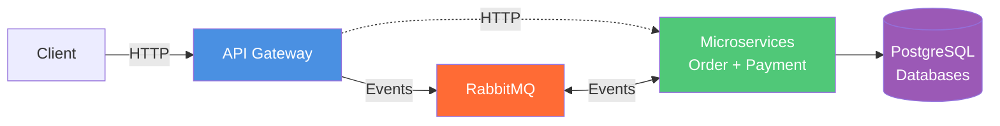

# 🧩 Payment Microservices System

A backend project that demonstrates a **microservices architecture** using **NestJS**, **RabbitMQ**, **Docker**, **PostgreSQL**, and **Prisma ORM**.
This project was built to showcase real-world backend architecture concepts such as **event-driven systems**, **CQRS pattern**, **asynchronous processing**, and **service separation**.


---

## 📐 Architecture

This project implements a **microservices architecture** with an **API Gateway** that orchestrates communication between services using both **synchronous HTTP** (for queries) and **asynchronous events** (for commands).


### Architecture Highlights

- **API Gateway**: Single entry point for all client requests (port 3000)
- **Event-Driven Commands**: POST/PATCH operations emit events via RabbitMQ
- **Synchronous Queries**: GET operations make direct HTTP calls to microservices
- **CQRS Pattern**: Separation of Commands (write) and Queries (read)
- **Service Autonomy**: Each microservice has its own database and business logic
- **Decoupled Communication**: Services communicate through events, not direct calls

---

## 🏗️ Project Structure
```
payment-microservices/
├── apps/
│   ├── api-gateway/                 # API Gateway (Port 3000)
│   │   └── src/
│   │       ├── common/
│   │       │   └── http-client.helper.ts
│   │       └── modules/
│   │           ├── orders/
│   │           │   ├── dto/
│   │           │   ├── orders.controller.ts
│   │           │   ├── orders.service.ts
│   │           │   └── orders.module.ts
│   │           └── payments/
│   │               ├── payments.controller.ts
│   │               ├── payments.service.ts
│   │               └── payments.module.ts
│   │
│   ├── order-service/               # Order Microservice (Port 3001)
│   │   └── src/
│   │       └── modules/
│   │           └── order/
│   │               ├── dto/
│   │               ├── order.consumer.ts
│   │               ├── order.controller.ts
│   │               └── order.service.ts
│   │
│   └── payment-service/             # Payment Microservice (Port 3002)
│       └── src/
│           └── modules/
│               └── payment/
│                   ├── dto/
│                   ├── payment.consumer.ts
│                   ├── payment.controller.ts
│                   └── payment.service.ts
│
├── libs/
│   ├── contracts/                   # Shared contracts
│   │   ├── events/                  # Event definitions
│   │   │   ├── order-created.event.ts
│   │   │   ├── order-cancelled.event.ts
│   │   │   ├── payment-approved.event.ts
│   │   │   ├── payment-declined.event.ts
│   │   │   └── payment-failed.event.ts
│   │   └── types/
│   │       └── event-types.enum.ts
│   │
│   ├── database/                    
│   │   └── prisma/
│   │       ├── schema.prisma
│   │       ├── prisma.module.ts
│   │       ├── prisma.service.ts
│   │       └── migrations/
│   │
│   └── messaging/                   # Shared RabbitMQ module
│       └── rabbitmq/
│           ├── config/
│           ├── constants/
│           ├── rabbitmq.module.ts
│           └── rabbitmq.service.ts
│
├── docker-compose.yml
└── README.md
```

---

## 🚀 Features

### ✅ API Gateway
- Single entry point for all client requests
- Routes queries (GET) directly to microservices via HTTP
- Emits events for commands (POST/PATCH) via RabbitMQ
- Centralized error handling and logging
- Request timeout and retry logic

### ✅ Order Service
- Manages order lifecycle (PENDING → PAID → CANCELLED → FAILED)
- Consumes `order.created` and `order.cancelled` events
- Emits `payment.approved`, `payment.declined`, `payment.failed` events
- RESTful API for order queries (GET endpoints)
- Isolated PostgreSQL database

### ✅ Payment Service
- Manages payment processing (PROCESSING → APPROVED/DECLINED/FAILED/REFUNDED/CANCELLED)
- Consumes `order.created` event to initiate payments
- Simulates payment gateway integration with approval/decline logic
- Provides payment statistics and queries
- Isolated PostgreSQL database

### ✅ Event-Driven Architecture
- RabbitMQ for asynchronous messaging
- Dead Letter Queue (DLQ) for failed messages
- Event replay and idempotency handling
- Durable queues and persistent messages

### ✅ CQRS Pattern
- **Commands** (POST/PATCH): Processed asynchronously via events
- **Queries** (GET): Processed synchronously via HTTP
- Optimized for performance and scalability

---

## 🛠️ Technologies

| Technology | Purpose |
|------------|---------|
| **NestJS** | Backend framework for building scalable Node.js applications |
| **TypeScript** | Type-safe language for robust code |
| **RabbitMQ** | Message broker for event-driven architecture |
| **PostgreSQL** | Relational database for order and payment data |
| **Prisma ORM** | Type-safe database access and migrations |
| **Docker** | Containerization for consistent environments |
| **Docker Compose** | Multi-container orchestration |

---

## 📦 Installation

### Prerequisites

- **Node.js** (v18+)
- **Docker** and **Docker Compose**
- **npm** or **yarn**

### Steps

1. **Clone the repository**
```bash
   git clone https://github.com/luchersou/payment-microservice.git
   cd payment-microservices
```

2. **Install dependencies**
```bash
   npm install
```

3. **Start services with Docker Compose**
```bash
   docker-compose up --build
```

---

## 🔌 API Endpoints

All requests go through the **API Gateway** on `http://localhost:3000/api`

### 📋 Orders

| Method | Endpoint | Description |
|--------|----------|-------------|
| `POST` | `/orders` | Create a new order (emits event) |
| `GET` | `/orders` | Get all orders (paginated) |
| `GET` | `/orders/:id` | Get order by ID |
| `PATCH` | `/orders/:id` | Update order status (emits event) |

### 💳 Payments

| Method | Endpoint | Description |
|--------|----------|-------------|
| `GET` | `/payments` | Get all payments (paginated) |
| `GET` | `/payments/:id` | Get payment by ID |
| `GET` | `/payments/order/:orderId` | Get payment by order ID |
| `GET` | `/payments/stats` | Get payment statistics by status |

---

## 📡 Event Flow

### Create Order Flow
```
1. Client → POST /api/orders
2. API Gateway → Emit order.created event → RabbitMQ
3. Order Service → Consume order.created → Save order (status: PENDING)
4. Payment Service → Consume order.created → Create payment (status: PROCESSING)
5. Payment Service → Simulate payment gateway → Approve/Decline
6. Payment Service → Emit payment.approved/declined → RabbitMQ
7. Order Service → Consume payment event → Update order (status: PAID/FAILED)
```

### Cancel Order Flow
```
1. Client → PATCH /api/orders/:id (status: CANCELLED)
2. API Gateway → Emit order.cancelled event → RabbitMQ
3. Order Service → Consume order.cancelled → Update order (status: CANCELLED)
4. Payment Service → Consume order.cancelled → Handle refund/cancellation
   - If PROCESSING → Mark as CANCELLED
   - If APPROVED → Mark as REFUNDED
```

---

## 🧪 Example Requests

### 📋 Orders

#### Create Order
```bash
POST http://localhost:3000/api/orders
Content-Type: application/json

{
  "userId": "d55fa6d6-63c2-4633-aeaf-ecf0c80fb48f",
  "total": 999
}
```

**cURL:**
```bash
curl -X POST http://localhost:3000/api/orders \
  -H "Content-Type: application/json" \
  -d '{
    "userId": "d55fa6d6-63c2-4633-aeaf-ecf0c80fb48f",
    "total": 999
  }'
```

**Response:**
```json
{
    "orderId": "11c4a663-47fd-4590-9c2d-ee72cc58bbbd",
    "message": "Order creation request accepted",
    "status": "PENDING_PAYMENT"
}
```

#### Get All Orders (Paginated)
```bash
GET http://localhost:3000/api/orders?page=1&limit=10
```

**cURL:**
```bash
curl http://localhost:3000/api/orders?page=1&limit=10
```

**Response:**
```json
{
  "data": [
    {
      "id": "476f5730-aa83-4ff0-ab9f-d6e19836e195",
      "userId": "d55fa6d6-63c2-4633-aeaf-ecf0c80fb48f",
      "total": 999,
      "status": "PAID",
      "createdAt": "2026-02-15T01:42:19.000Z",
      "updatedAt": "2026-02-15T01:42:21.000Z"
    },
    {
      "id": "b7740f92-e574-4936-aa23-56f98ba61418",
      "userId": "d55fa6d6-63c2-4633-aeaf-ecf0c80fb48f",
      "total": 999,
      "status": "CANCELLED",
      "createdAt": "2026-02-15T01:42:39.000Z",
      "updatedAt": "2026-02-15T01:42:40.000Z"
    }
  ],
  "meta": {
    "page": 1,
    "limit": 10,
    "total": 2,
    "totalPages": 1
  }
}
```

#### Get Order by ID
```bash
GET http://localhost:3000/api/orders/476f5730-aa83-4ff0-ab9f-d6e19836e195
```

**cURL:**
```bash
curl http://localhost:3000/api/orders/476f5730-aa83-4ff0-ab9f-d6e19836e195
```

**Response:**
```json
{
  "id": "476f5730-aa83-4ff0-ab9f-d6e19836e195",
  "userId": "d55fa6d6-63c2-4633-aeaf-ecf0c80fb48f",
  "total": 999,
  "status": "PAID",
  "createdAt": "2026-02-15T01:42:19.000Z",
  "updatedAt": "2026-02-15T01:42:21.000Z"
}
```

#### Cancel Order (Manual)
```bash
PATCH http://localhost:3000/api/orders/476f5730-aa83-4ff0-ab9f-d6e19836e195/cancel
```

**cURL:**
```bash
curl -X PATCH http://localhost:3000/api/orders/476f5730-aa83-4ff0-ab9f-d6e19836e195 \
  -H "Content-Type: application/json" \
  -d '{"status": "CANCELLED"}'
```

**Response:**
```json
{
    "orderId": "476f5730-aa83-4ff0-ab9f-d6e19836e195",
    "message": "Order cancellation request accepted"
}
```

---

### 💳 Payments

#### Get All Payments (Paginated)
```bash
GET http://localhost:3000/api/payments?page=1&limit=10
```

**cURL:**
```bash
curl http://localhost:3000/api/payments?page=1&limit=10
```

**Response:**
```json
{
  "data": [
    {
      "id": "8a5da4d7-3512-4c74-bd62-64b6c0e93e7a",
      "orderId": "476f5730-aa83-4ff0-ab9f-d6e19836e195",
      "amount": 999,
      "status": "APPROVED",
      "createdAt": "2026-02-15T01:42:19.500Z",
      "updatedAt": "2026-02-15T01:42:20.500Z"
    },
    {
      "id": "1220b65f-df5f-456d-8238-e03520bff097",
      "orderId": "b7740f92-e574-4936-aa23-56f98ba61418",
      "amount": 999,
      "status": "DECLINED",
      "createdAt": "2026-02-15T01:42:39.200Z",
      "updatedAt": "2026-02-15T01:42:40.200Z"
    }
  ],
  "meta": {
    "page": 1,
    "limit": 10,
    "total": 2,
    "totalPages": 1
  }
}
```

#### Get Payment by ID
```bash
GET http://localhost:3000/api/payments/8a5da4d7-3512-4c74-bd62-64b6c0e93e7a
```

**cURL:**
```bash
curl http://localhost:3000/api/payments/8a5da4d7-3512-4c74-bd62-64b6c0e93e7a
```

**Response:**
```json
{
  "id": "8a5da4d7-3512-4c74-bd62-64b6c0e93e7a",
  "orderId": "476f5730-aa83-4ff0-ab9f-d6e19836e195",
  "amount": 999,
  "status": "APPROVED",
  "createdAt": "2026-02-15T01:42:19.500Z",
  "updatedAt": "2026-02-15T01:42:20.500Z"
}
```

#### Get Payment by Order ID
```bash
GET http://localhost:3000/api/payments/order/476f5730-aa83-4ff0-ab9f-d6e19836e195
```

**cURL:**
```bash
curl http://localhost:3000/api/payments/order/476f5730-aa83-4ff0-ab9f-d6e19836e195
```

**Response:**
```json
{
  "id": "8a5da4d7-3512-4c74-bd62-64b6c0e93e7a",
  "orderId": "476f5730-aa83-4ff0-ab9f-d6e19836e195",
  "amount": 999,
  "status": "APPROVED",
  "createdAt": "2026-02-15T01:42:19.500Z",
  "updatedAt": "2026-02-15T01:42:20.500Z"
}
```

#### Get Payment Statistics
```bash
GET http://localhost:3000/api/payments/stats
```

**cURL:**
```bash
curl http://localhost:3000/api/payments/stats
```

**Response:**
```json
{
  "byStatus": [
    {
      "status": "APPROVED",
      "count": 2,
      "totalAmount": 1998
    },
    {
      "status": "DECLINED",
      "count": 1,
      "totalAmount": 999
    }
  ]
}
```

---

## 🏛️ Design Patterns Used

- **Microservices Architecture**: Independent services with isolated databases
- **API Gateway Pattern**: Single entry point for client requests
- **Event-Driven Architecture**: Asynchronous communication via events
- **CQRS (Command Query Responsibility Segregation)**: Separate read and write operations

---

## 📄 License

This project is licensed under the MIT License.

---

## 👤 Author

Lucas Herzinger Souza
- GitHub: [@luchersou](https://github.com/luchersou)
